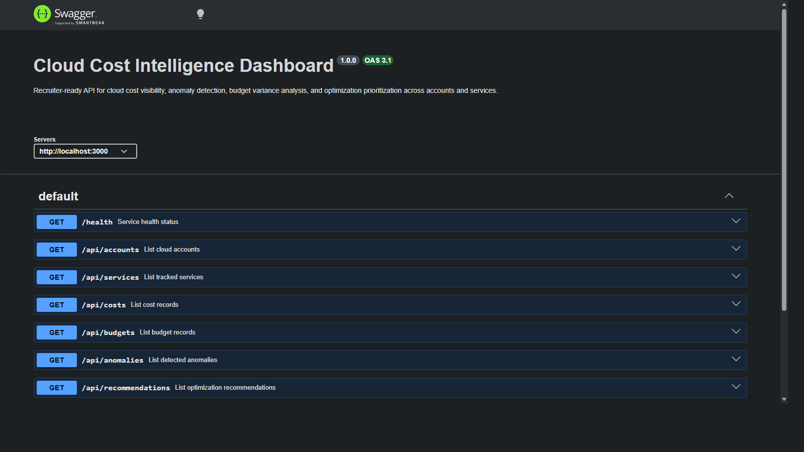
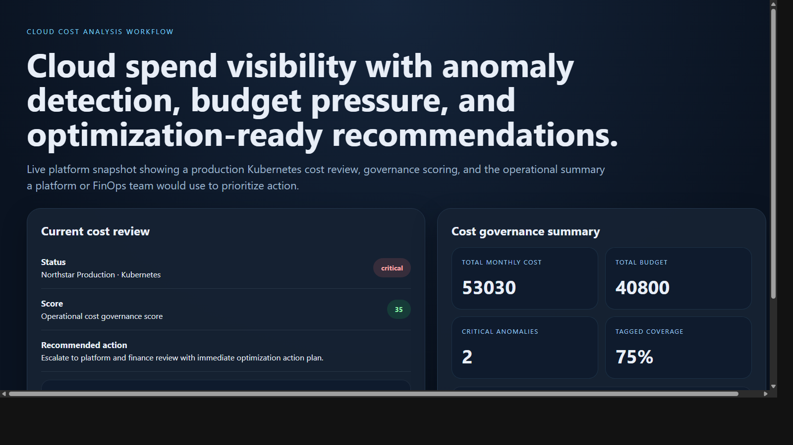
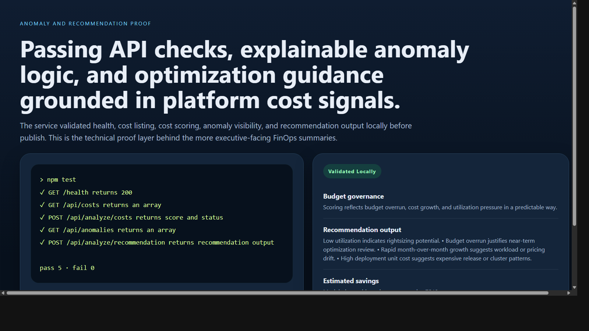

# Cloud Cost Intelligence Dashboard

> **TypeScript FinOps portfolio project** demonstrating cloud spend visibility, budget variance review, anomaly detection, optimization prioritization, and platform-oriented cost governance.

**Recruiter takeaway:** *"This person understands cloud cost as an engineering and operations governance problem, not just a billing export."*

---

## Project Overview

| Attribute | Detail |
|---|---|
| **Runtime** | Node.js + TypeScript |
| **Framework** | Express 5 |
| **Domain** | Cloud cost intelligence and FinOps operations |
| **Analysis Areas** | Budget variance · Growth spikes · Idle capacity · Allocation hygiene · Unit economics |
| **Operational Outputs** | Anomalies · Recommendations · Dashboard summaries |
| **Docs** | Swagger UI at `/docs` |

---

## Executive Summary

Cloud Cost Intelligence Dashboard models the kind of internal platform service engineering leadership, DevOps teams, and finance stakeholders use to understand where infrastructure spend is going and what to optimize next. Instead of presenting raw cost numbers, the API turns modeled cost data into actionable operational signals such as budget overrun severity, low-utilization risk, month-over-month cost spikes, and optimization recommendations.

The result is a recruiter-facing backend project that feels like a realistic FinOps and cloud governance capability rather than a toy dashboard or CSV parser.

---

## Architecture

```text
Cloud billing or cost scenario input
    |
    v
POST /api/analyze/*
    |
    +--> Request validation
    +--> Budget and growth checks
    +--> Utilization and unit-cost review
    +--> Recommendation scoring
    |
    v
Operational review output
    |
    +--> healthy
    +--> needs-review
    +--> critical
```

### Cost Analysis Workflow

1. Teams submit a cost scenario or query cost records and budgets.
2. The service validates request shape with Zod.
3. Analysis logic reviews budget variance, month-over-month growth, utilization, tagging, and unit economics.
4. The service returns a score, issues, passed checks, and a recommended next action.
5. Operators use `/api/dashboard/summary`, `/api/anomalies`, and `/api/recommendations` to prioritize cost optimization work.

---

## Scoring Model

### Cost Review

Analysis scoring covers:

- spend vs budget
- month-over-month growth
- utilization-driven idle capacity risk
- request and deployment unit cost pressure
- allocation tagging completeness

### Recommendation Prioritization

Recommendation output estimates savings and priority based on:

- budget overrun magnitude
- cost acceleration
- low utilization
- operational efficiency patterns

---

## API Endpoints

| Method | Endpoint | Purpose |
|---|---|---|
| `GET` | `/health` | Service status and uptime |
| `GET` | `/api/accounts` | List cloud accounts |
| `GET` | `/api/services` | List tracked services |
| `GET` | `/api/costs` | List cost records |
| `GET` | `/api/budgets` | List budget records |
| `GET` | `/api/anomalies` | List modeled anomalies |
| `GET` | `/api/recommendations` | List optimization recommendations |
| `GET` | `/api/dashboard/summary` | Cost governance summary |
| `POST` | `/api/analyze/costs` | Analyze a cloud cost scenario |
| `POST` | `/api/analyze/anomaly` | Analyze anomaly severity |
| `POST` | `/api/analyze/recommendation` | Generate optimization guidance |

---

## Sample Analysis Request

```json
{
  "accountName": "Northstar Production",
  "service": "Kubernetes",
  "monthlyCost": 18240,
  "previousMonthlyCost": 12110,
  "budget": 14000,
  "environment": "production",
  "utilizationRate": 0.41,
  "costPerCustomer": 18.2,
  "costPerDeployment": 456,
  "costPerThousandRequests": 108
}
```

## Sample Analysis Response

```json
{
  "status": "critical",
  "score": 35,
  "issues": [
    "Monthly spend is 30% above budget.",
    "Month-over-month cost growth exceeds governance threshold.",
    "Utilization rate suggests overprovisioned compute or storage capacity.",
    "Cost per deployment is elevated for a production service and should be reviewed.",
    "Cost per 1k requests is materially above the modeled efficiency target."
  ],
  "passedChecks": [
    "Cost allocation tags are present.",
    "Service is mapped to a tracked business unit."
  ],
  "recommendedNextAction": "Escalate to platform and finance review with immediate optimization action plan."
}
```

---

## Screenshots

### Hero Capture



### Cloud Cost Analysis Workflow



### Anomaly and Recommendation Proof



---

## Getting Started

### Prerequisites

- Node.js 20+
- npm

### Setup

```bash
git clone https://github.com/mizcausevic-dev/cloud-cost-intelligence-dashboard.git
cd cloud-cost-intelligence-dashboard
npm install
cp .env.example .env
npm run dev
```

Visit:

- `http://localhost:3000/docs`
- `http://localhost:3000/api/costs`
- `http://localhost:3000/api/dashboard/summary`

### Run Tests

```bash
npm test
```

---

## What This Demonstrates

- cloud cost analysis translated into backend service logic
- budget governance and anomaly detection thinking
- platform, DevOps, and finance alignment
- optimization prioritization instead of raw cost dumps
- production-minded TypeScript API structure with docs, tests, and operational summaries

---

## Future Enhancements

- persist billing history in PostgreSQL
- ingest exports from AWS, GCP, or Azure billing pipelines
- add scheduled anomaly detection across longer historical windows
- integrate Slack or email alerting for cost spikes
- support chargeback and showback reporting by team

---

## Tech Stack

- Node.js
- TypeScript
- Express
- Zod
- Swagger / OpenAPI
- Helmet
- CORS
- Morgan
- Node test runner + Supertest

### Portfolio Links

- [LinkedIn](https://www.linkedin.com/in/mirzacausevic)
- [Skills Page](https://mizcausevic.com/skills/)
- [Medium](https://medium.com/@mizcausevic)
- [GitHub](https://github.com/mizcausevic-dev)

---

*Part of [mizcausevic-dev's GitHub portfolio](https://github.com/mizcausevic-dev) — demonstrating FinOps analysis, platform cost governance, and production-aware infrastructure operations.*
